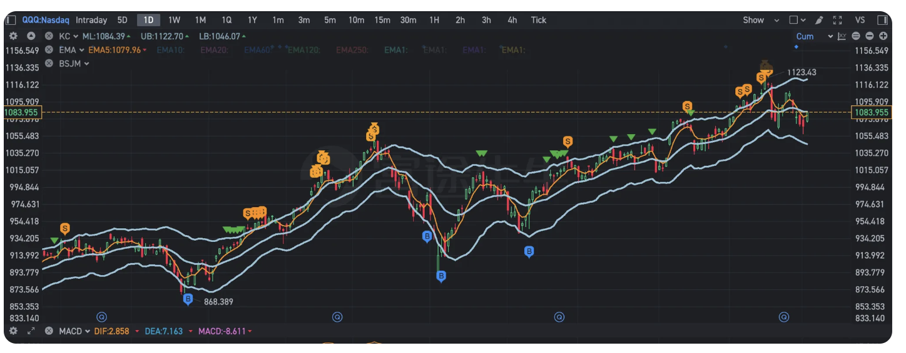
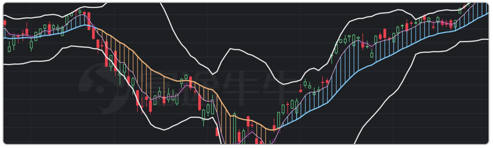

# Futu.Index

## Overview
This repository contains custom trading indicator scripts for Futu Bull, written in Pascal-like syntax. The scripts are designed to help visualize market trends and generate buy/sell signals using technical analysis. 

## My takes
I began with buy/sell signals but later shifted to trends, as they're simpler and less stressful for me.

## Files
- **BSJM.pas**: Advanced buy/sell point strategy based on KDJ, KC, and MACD indicators. Includes multi-level confirmation logic and adaptive parameters.

- **JCT.pas**: Trend visualization using 5-day and 20-day moving averages. Colors indicate uptrend, downtrend, and possible reversal. Includes volatility bands and marker logic for short-term trend opposition points.

## Features
- Multi-indicator buy/sell signal generation
- Trend detection and visualization
- Volatility bands (Bollinger-like)
- Adaptive marker placement for visual clarity

## Usage
1. Import the `.pas` scripts into Futu Bull's custom indicator editor.
2. Adjust parameters as needed for your trading style.
3. View the generated signals and trend lines on your chart.

## Example: JCT.pas
- **MA20**: 20-day EMA, blue line for uptrend
- **MA5**: 5-day EMA, purple line for short-term trend
- **DOWN**: Orange line for downtrend
- **UPPER/LOWER**: Volatility bands
- **MARKER**: Special symbol for short-term trend opposition

## Author
Jacob.Mi

## Version History
See comments in each script for detailed version history and change logs.

---
For questions or suggestions, please contact the repository owner.
